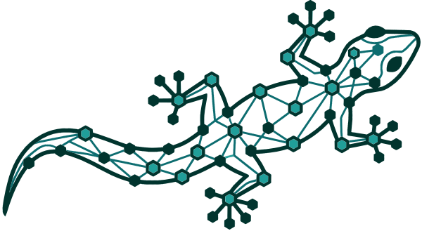

<p align="center">
  
</p>

# GECKO: Graph Execution of Contextual Knowledge Objects

[](https://www.rust-lang.org)
[](https://typedb.com/)
[](https://wasmtime.dev/)
[](https://github.com/k4otix/gecko/actions/workflows/ci.yml)
[](LICENSE)

At its core, **GECKO** is a strongly-typed semantic knowledge graph designed to underlie Open Knowledge Framework (OKF) objects. While GECKO acts as a high-performance framework for orchestrating execution and context-aware workflows, its foundational capability is ingesting human-readable documentation bundles and rigorously mapping them into an interconnected, queryable graph of domain knowledge.

Built in Rust and backed by TypeDB 3.x, GECKO bridges the gap between static domain documentation and automated execution, enabling complex, graph-traversal-driven capabilities in a secure, all-WebAssembly sandboxed environment. It also ships an **epistemic memory substrate** — a bitemporal graph of beliefs, provenance, and semantic recall — so agents can remember, retrieve, and derive new conclusions with a full audit trail.

## Use Cases

GECKO is designed to serve as the intelligence and orchestration layer for complex, domain-specific systems. Common use cases include:

*   **Workflow Orchestration:** Automate multi-step processes by executing playbooks that interact with host capabilities through a capability-gated WebAssembly sandbox.
*   **Knowledge Management:** Parse Markdown and YAML documentation bundles to build a dynamic, relational ontology of your organization's infrastructure, policies, and concepts.
*   **Intelligent Autonomous Agents:** Provide a semantic, contextual graph memory (`mem-gecko`) and a rigorous operational environment (`cyber-gecko`) for AI agents reasoning over complex environments — with belief revision, retrieval-provenance, and as-of-time recall.
*   **Extensible Domain Logic:** Compose custom capabilities using the Assembler pattern, binding new host functions without sacrificing security or rewriting the core engine.

## Core Architecture

GECKO is built around a few fundamental components:

*   **Open Knowledge Format (OKF) Parser**: Ingests Markdown bundles augmented with YAML frontmatter, parsing hierarchical directories of domain concepts, playbooks, and relationships.
*   **Knowledge Graph Syncer**: Maps parsed OKF concepts into a TypeDB 3.x database. The syncer is idempotent (content-hashed, parameterized writes) and builds the entity-relation hierarchy (containment, concept links, hierarchy edges, and citations).
*   **All-WASM Execution Engine**: Executes playbook code blocks in a secure, isolated **Wasmtime** WebAssembly sandbox with deterministic execution limits (epoch timeouts, bounded memory) and a single, JSON-marshalled host-function boundary. JavaScript playbooks run inside a checked-in WASM guest (a Boa JS engine, selected with `engine: quickjs`). Native Rhai was removed in the all-WASM rewrite.
*   **Epistemic Memory Substrate (`mem-gecko`)**: A bitemporal TypeDB schema of beliefs, episodes, provenance, and reified resolutions, exposed to playbooks through a `mem.*` sandbox namespace (`recall`/`remember`/`derive`/`supersede`/`contest`). An optional in-process HNSW **semantic index** (`gecko-semantic-index`) accelerates recall; it is a pure, rebuildable accelerator, never a source of truth.
*   **The Assembler Pattern**: GECKO uses Rust traits to compose the core engine with domain extensions **at compile time**, producing a single optimized binary. One binary ships every compiled-in extension; `gecko.toml` selects which are *activated* at runtime — registration is the gate for loading host functions and opening write-paths.

## Repository Structure

The project is divided into core abstractions, domain extensions, and the final assembler binary:

*   **`core/gecko-engine/`**: The core framework library — the OKF parser, the TypeDB router and idempotent sync logic, the foundational TypeQL schema, and the Wasmtime execution sandbox with its host bridges.
*   **`core/gecko-extension-api/`**: The extension contract — the `GeckoExtension` trait plus the `EpistemicWriter`/`EpistemicReader` epistemic-memory traits and shared types. Depend on this to build an extension without pulling in the engine.
*   **`core/mem-gecko/`**: The epistemic memory substrate (always-on; not an optional feature). Bitemporal belief/provenance schema, index-seeded recall, and the A5.7 retrieval-provenance write path.
*   **`core/gecko-semantic-index/`**: The in-process HNSW semantic index and embedder (a deterministic stub by default; a candle-backed `bge-large-en-v1.5` embedder behind the `real-embedder` feature).
*   **`core/js-sandbox/`**: Source for the WebAssembly JS guest (Boa), compiled to `wasm32-wasip1` and checked in as a prebuilt binary. See [`docs/refactor/guest-wasm.md`](docs/refactor/guest-wasm.md) for rebuilding.
*   **`extensions/cyber-gecko/`**: A domain extension for cybersecurity operations, defining entities like networks, vulnerabilities, and host configurations, and subtyping the core schema.
*   **`gecko-bin/`**: The final Assembler executable (`gecko`). It parses CLI arguments, instantiates the core engine, wires the selected extensions, and dispatches the execution lifecycle.

## Getting Started

### Prerequisites

*   Rust toolchain (stable; edition 2024, so **Rust 1.85+**). The `wasm32-wasip1` target is pinned in `rust-toolchain.toml` and only needed if you rebuild the JS guest.
*   TypeDB 3.x — run your own, or let `gecko up` download and manage a pinned server for you.

### Install (pre-built binaries)

For most users, a pre-built per-platform binary from [GitHub Releases](https://github.com/k4otix/gecko/releases) is faster than compiling. **The download is small (tens of MB): neither the ~1.3 GB embedding model nor TypeDB is ever bundled** — both are runtime assets fetched separately, on your terms.

```bash
# 1. Install the binary (detects OS/arch, grabs the matching release asset)
curl -fsSL https://raw.githubusercontent.com/k4otix/gecko/main/scripts/install.sh | sh

# 2. Bring up the pinned TypeDB (downloaded once, run as a managed child process)
gecko up

# 3. Apply the schema, then sync a bundle — records-only, no embedding model required
gecko schema-init
gecko sync sample-bundle
```

That basic path never touches the ~1.3 GB embedding model. **Semantic retrieval is a separate, explicit opt-in** (see below).

A Homebrew formula template is at `HomebrewFormula/gecko.rb` for maintainers cutting a tap. For the full first-run walkthrough and the **air-gapped / enterprise path** (pre-staged model + external TypeDB, zero runtime downloads), see [`docs/INSTALL.md`](docs/INSTALL.md).

### Build from source

```bash
# Fast dev build (stub embedder, candle NOT compiled)
cargo build --no-default-features

# Shipped binary with the working candle embedder
cargo build --release --features real-embedder

# Or install to your PATH
cargo install --path gecko-bin
```

*(You can also run any command straight from source: `cargo run -p gecko-bin -- <command>`.)*

## Usage

The `gecko` CLI manages the full lifecycle of the knowledge graph and playbook execution. A `sample-bundle/` is included to try it out.

| Command | Purpose |
| --- | --- |
| `gecko init` | Write a default `gecko.toml` if absent (idempotent; never clobbers). |
| `gecko up` / `gecko down` | Start/stop TypeDB (orchestrated pinned child, `compose`, or `external` mode). |
| `gecko schema-init` | Apply the core schema plus every activated extension's schema. |
| `gecko sync <bundle>` | Parse an OKF bundle directory and sync its concepts, hierarchy, and code blocks. |
| `gecko run <concept-id>` | Execute a synced playbook's code block in the sandbox. |
| `gecko query '<TypeQL>'` | Run an ad-hoc TypeQL read query. |
| `gecko status` | Show synced bundles and concept counts. |
| `gecko databases` / `gecko drop <name>` | List / delete TypeDB databases. |
| `gecko model fetch` | Pre-stage the embedding model into the cache (one-time ~1.3 GB). |
| `gecko doctor` | Report every precondition (config, cache, TypeDB, model, index, embedder) as ✓/⚠/✗ with a fix; non-zero exit iff a hard check fails. |

A typical first run:

```bash
gecko up                       # start TypeDB
gecko schema-init              # apply schemas
gecko sync sample-bundle       # ingest the sample OKF bundle

# Execute a JavaScript playbook in the WASM sandbox
gecko run playbooks/hello_js

# Inspect the graph
gecko query 'match $c isa concept, has concept-id $id; fetch {"id": $id};'
```

Concept IDs are bundle-relative (GECKO is single-bundle-scoped: one bundle per database), e.g. `playbooks/hello_js`.

## Epistemic Memory & Semantic Retrieval

The `mem` substrate is always compiled and always active — no feature flag, no rebuild. Playbooks reach it through an ergonomic sandbox namespace, each call **capability-gated** (see Security Model):

```javascript
// Surface prior memories, then derive a new belief FROM that evidence.
// GECKO auto-links the belief to what it was built from (retrieval provenance).
const chunks = mem.recall("lateral movement", { maxChunks: 5 });
const belief = mem.derive(
  "the host was likely compromised via SMB lateral movement",
  chunks.map((c) => c.id),
);
({ recalled: chunks.length, belief: belief.id });
```

`mem.*` exposes `recall`, `remember`, `derive`, `supersede`, and `contest`. The **host** stamps run identity (`run_id`/`actor`/`source`) — sandbox code cannot forge or supply it. A worked example ships at [`sample-bundle/playbooks/mem_recall_demo.md`](sample-bundle/playbooks/mem_recall_demo.md).

Semantic recall is an **explicit opt-in**. The default `gecko.toml` runs with a deterministic **stub** embedder (correctness/gating only). For real retrieval quality:

```bash
gecko model fetch      # stage bge-large-en-v1.5 (~1.3 GB, one time)
```

```toml
# gecko.toml
[semantic_index]
enabled  = true
embedder = "bge-large-en-v1.5"   # requires a build with the `real-embedder` feature
backend  = "hnsw"
record_retrieval_provenance = true
```

The index is a pure, rebuildable accelerator: when `enabled = false` (or absent), recall falls back to a non-vector path with zero drag on writes.

## Security Model

Security and isolation are foundational to GECKO's execution model. Playbooks run in a bounded Wasmtime sandbox and reach host capabilities only through an explicit, default-deny gate.

*   **Default-Deny Capability Scopes (S3)**: Every host call is gated on an `"ext:func"` scope the concept must grant in its frontmatter (`scopes: [mem:recall, mem:derive]`). Anything not granted is denied before the host callback ever runs.
*   **Deterministic, Bounded Execution**: The sandbox enforces epoch timeouts and bounded memory to guarantee termination and prevent denial-of-service via infinite loops.
*   **State Isolation**: Each playbook invocation gets an ephemeral, isolated execution context; there is no shared mutable state across parallel runs.
*   **No Ambient Authority**: Playbooks cannot touch the host filesystem or network. Capabilities are supplied only through vetted extension host functions, across a single JSON-marshalled boundary.

## Development

Common tasks are wrapped in the [`justfile`](justfile) (run `just` with no arguments to list recipes):

```bash
just build          # fast dev build (stub embedder, no candle)
just build-release  # release build with the candle embedder

just test           # Tier 1 — fast, serviceless, stub embedder (no candle/model/network)
just test-it        # Tier 2 — real TypeDB, still the stub embedder
just test-model     # Tier 3 — OPT-IN real bge-large model (first run downloads ~1.3 GB)

just up / just down # manage TypeDB
just doctor         # environment health check
just build-guest    # rebuild + re-commit the WASM JS guest after editing core/js-sandbox
just check          # pre-push gate: fmt + clippy + fast tests
```

CI (`ci.yml`) runs the candle-free, model-free suite against a TypeDB 3.12 service on every push; the real-model Tier-3 tests run nightly (`model-integration.yml`). The checked-in WASM guest is never rebuilt in CI — rebuild it locally with `just build-guest` and commit the binary.

## Contributing

GECKO is a solo hobby and research project, maintained in spare time — support is **best-effort** and there are no guarantees on review or merge timelines. That said, bug reports and small, focused pull requests are welcome. For larger changes, please open an issue to discuss the idea first. See [`CONTRIBUTING.md`](CONTRIBUTING.md) for the full details, and [`CLAUDE.md`](CLAUDE.md) for the code conventions.

When developing new extensions, adhere strictly to the `GeckoExtension` trait (in `core/gecko-extension-api`) and avoid breaking changes to the core TypeQL schema hierarchy. If you change the WASM JS guest (`core/js-sandbox/src/main.rs`), rebuild and commit the guest binary with `just build-guest`.

## License

Licensed under the [Apache License, Version 2.0](LICENSE). Unless you explicitly state otherwise, any contribution you submit for inclusion in GECKO shall be licensed as above, without any additional terms or conditions.
